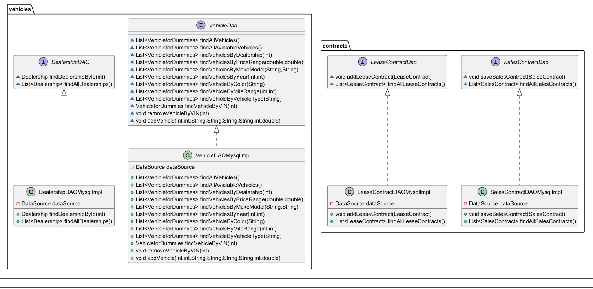

# JDBC Car Workshop

## 1. Description

This projects main purpose was to convert my all of my CSV code into a running database. Included is a SQL script to create
and populate the database. This MySQL database is a representation of a dealership, added with cars, dealerships, sales
and lease contracts.

## 2. What changed?
I have deleted all the files that have to do with adding to a CSV. We do not need any CSV files anymore now that we 
have the database made. In its place is a new packaging system that is meant to use the MVC layout (Model, View, Controller).
Also included is a dao package, use for CRUD operations for each table

## 3. What is each used for?
Currently, I have each class be in control for each table. Mainly used is the VehicleDAO that is made to search for different
cars with different criteria. The lease and sales contract are made to add contracts into each table as well as read from them
for the AdminUI.

## 4. Does it all work?
Well I hope so! I have unit tests made so that I get my information correct and I have done my own tests to make sure that 
everything is made correctly. But as always I am able to miss slight bugs that may be happening or anything that might happen
in the future. 

## 5. Author
### Jacob Lockhart :)